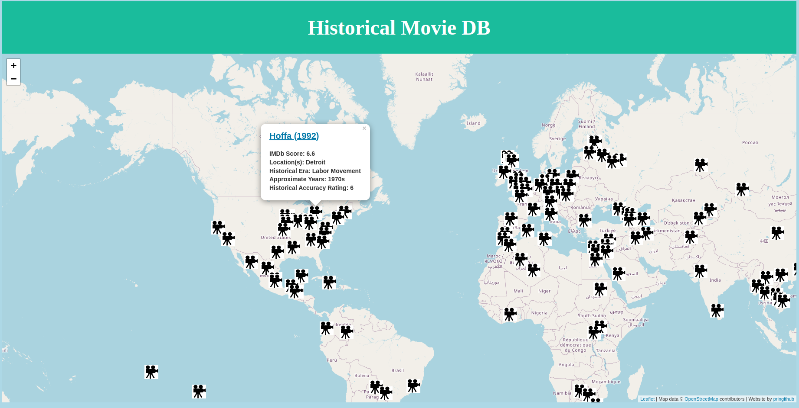
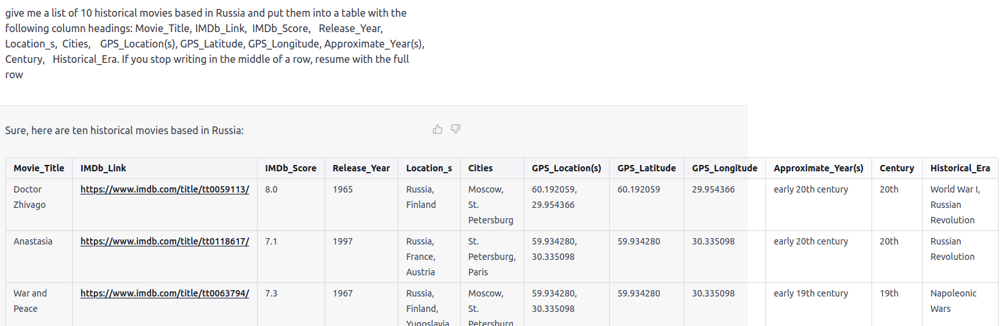

# Historical Movie Database
The Historical Movie Database is a website and database that attempts to organize and display historical movies where they took place on a world map.

[Access the Website](https://pringithub.github.io/historical_movie_db/)

## Purpose
This project came out of my love for movies that attempt to recreate the past: historical epics, documentaries, and the like. I wanted to have a one-stop place where I could browse movies by location and time period relatively easily.
While there are numerous existing movie databases out there (e.g. IMDb), there are none that combine historical and geographic location data. Thus, I needed to create my own.

## Generating the Database
Creating a large database manually would have been slow, laborious, and taxing. 
I decided to build the database with help from ChatGPT. I input the following prompt, and modity it based on what answers I get, or if I get duplicates: 
>"give me a list of 10 historical movies based in [region] and put them into a table with the following column headings: Movie_Title,	IMDb_Link,	IMDb_Score,	Release_Year, Location_s,	Cities,	GPS_Location(s), GPS_Latitude, GPS_Longitude, Approximate_Year(s),	Century,	Historical_Era. If you stop writing in the middle of a row, resume with the full row"

A few seconds later, I get a neatly formatted table with relevant info, as shown below. While this can still be a slow, it is less mind-numbing than thinking of a movie, scraping IMDb for basic data, and then attempting to find the relevant geohistorical data by oneself. Yes there are errors (esp with ~30% of links being incorrect) but it is easier to fix existing data than to create it on one's own.

## Features
Generates a list of historical movies based on a user's input of start and end years.
Includes metadata about each movie, such as the year it was released, the director, and the cast.

## TODO
- [ ] Integrate sliders to filter movies shown based on Release_Year, IMDb_Score, and Approximate_Year
- [x] Add support for multiple locations per movie, if applicable
- [ ] Add db column for historical accuracy, with explanations
- [ ] Move database to online site (sheets/airtable/firebase) for easier syncing
- [ ] Check each movie's location, historical details for inaccuracies
- [ ] Ideate faster ways of database generation
- [x] Databse has 100 movies
- [ ] Database has 1000 movies
- [ ] Database has at least one movie per country
